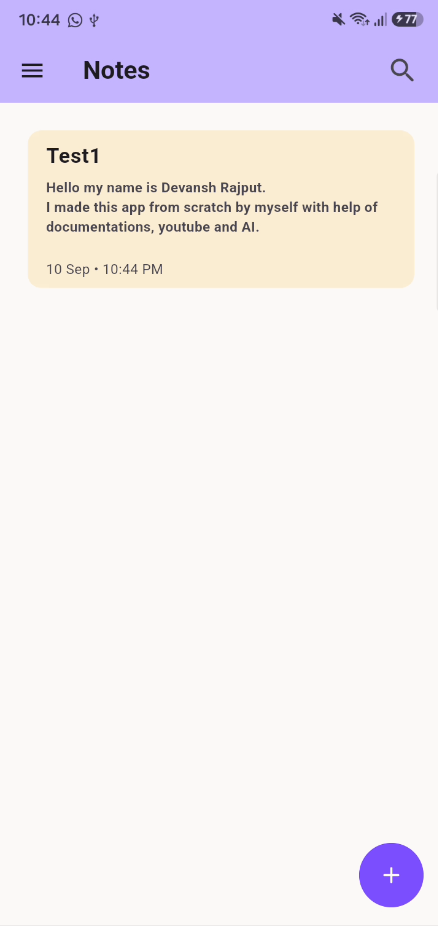
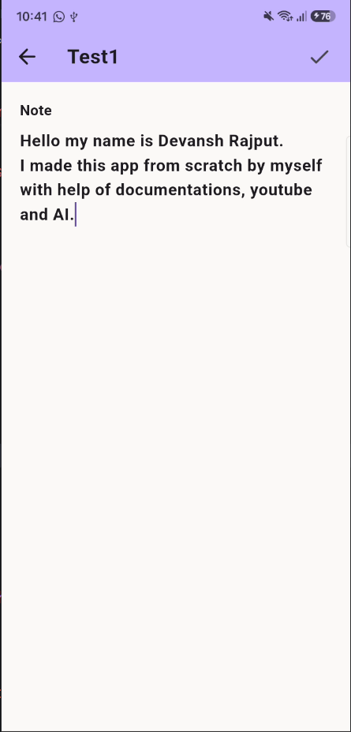
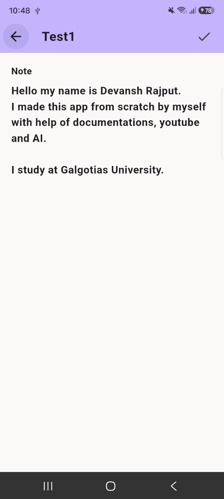
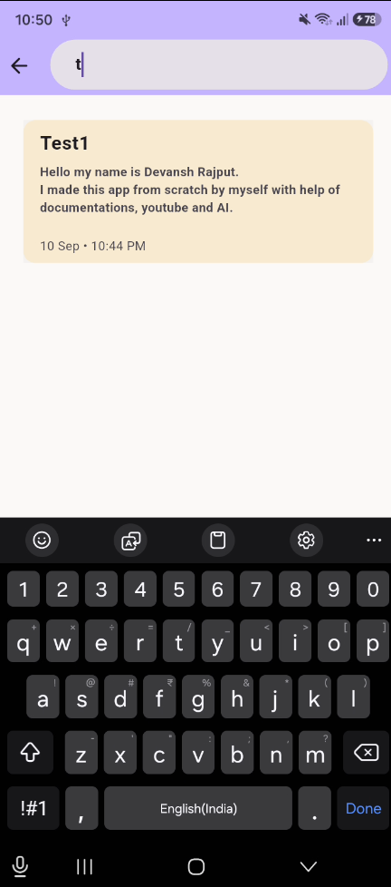

# Notes App

> A clean, minimal and locally persistent **Notes application built with Flutter** for the **TechnoJam TJ-Tasks 2026** selection task.

The application provides a simple way to **create, edit, search and manage notes**, with a modular project structure designed to keep the codebase maintainable and easy to extend.

---

## ✨ Features

| Feature                   | Description                                      |
| :------------------------ | :----------------------------------------------- |
| 📝 **Create Notes**       | Create notes with a title and detailed content   |
| ✏️ **Edit Notes**         | Modify existing notes whenever needed            |
| 🗑️ **Delete Notes**       | Delete unwanted notes                            |
| 🔍 **Search**             | Search notes by title                            |
| 💾 **Local Storage**      | Notes remain available after restarting the app  |
| 📅 **Creation Date**      | Keep track of when notes were created            |
| 📏 **Character Limits**   | Prevent excessively long titles and note content |
| 👆 **Long Press Actions** | Quickly access note actions                      |
| 🎨 **Minimal UI**         | Simple interface focused on usability            |

---

## 🛠️ Tech Stack

- **Flutter** — UI framework
- **Dart** — Programming language
- **SharedPreferences** — Local data persistence
- **Intl** — Date formatting
- **Material Design** — UI components

---

## 📂 Project Structure

```text
lib/
│
├── constants/
│   └── App-wide constants such as colors, fonts and sizing
│
├── models/
│   └── Data models used by the application
│
├── pages/
│   └── Application screens
│
├── services/
│   └── Local storage and application services
│
├── widgets/
│   └── Reusable UI components
│
└── main.dart
```

The project follows a **modular structure**, separating UI, data models, services, reusable widgets and constants.

This makes individual parts of the application easier to understand, debug and modify.

---

## ⚙️ Approach

The application is built around a simple **CRUD-based notes system** with local persistence.

### 1. Note Model

Each note is represented using a dedicated model containing information such as:

- Note ID
- Title
- Content
- Creation date

This keeps note-related data organized and allows individual notes to be identified and modified easily.

---

### 2. Local Storage

The application uses **SharedPreferences** instead of a remote database.

The general data flow is:

```text
┌─────────────┐
│ User Action │
└──────┬──────┘
       ↓
┌─────────────┐
│  Notes UI   │
└──────┬──────┘
       ↓
┌─────────────┐
│ Note Model  │
└──────┬──────┘
       ↓
┌─────────────┐
│   Storage   │
│   Service   │
└──────┬──────┘
       ↓
┌───────────────────┐
│ SharedPreferences │
└───────────────────┘
```

When the application starts, previously stored notes are loaded from local storage.

Whenever a note is created, edited or deleted, the stored data is updated accordingly.

---

### 3. CRUD Operations

The application implements the fundamental CRUD operations:

```text
Create → Add a new note
Read   → Display saved notes
Update → Edit an existing note
Delete → Delete an existing note
```

This provides the core functionality expected from a basic notes application.

---

### 4. Search

The search functionality operates on **note titles**.

```text
┌───────────────┐
│ Search Query  │
└───────┬───────┘
        ↓
┌────────────────────┐
│ Compare with titles│
└────────┬───────────┘
         ↓
┌─────────────────┐
│ Filter matches  │
└────────┬────────┘
         ↓
┌─────────────────┐
│ Display results │
└─────────────────┘
```

If no notes match the search query, an appropriate empty-state message is displayed.

---

### 5. Navigation

The application separates its functionality into different pages:

```text
Home
 │
 ├── New / Edit Note
 │
 └── Settings
```

Flutter's navigation system is used to move between these screens.

---

## 📱 Screenshots

### 🏠 Home Screen



---

### 📝 Create / Edit Note




---

### 🔍 Search



---

## 🚀 Getting Started

### Prerequisites

Make sure the following are installed:

- Flutter SDK
- Dart SDK
- Android Studio or another Flutter-compatible IDE
- Android emulator or a physical Android device

### 1. Clone the Repository

```bash
git clone https://github.com/devlogicx01/TJ-Tasks-2026-Devansh-Rajput.git
```

### 2. Navigate to the Project

```bash
cd TJ-Tasks-2026-Devansh-Rajput
```

### 3. Install Dependencies

```bash
flutter pub get
```

### 4. Run the Application

```bash
flutter run
```

---

## 📦 Dependencies

| Package              | Purpose                  |
| :------------------- | :----------------------- |
| `shared_preferences` | Local data storage       |
| `intl`               | Date and time formatting |
| `cupertino_icons`    | Cupertino-style icons    |

---

## 🧠 Design Decisions

### Local-First Storage

The application does not require an internet connection to create or access notes.

Using local storage keeps the application simple while ensuring that notes persist between application sessions.

### Modular Architecture

Instead of keeping the entire application inside `main.dart`, functionality is separated into:

- **Models** — Data representation
- **Pages** — Application screens
- **Services** — Data and storage logic
- **Widgets** — Reusable UI components
- **Constants** — Shared application values

This separation makes the codebase easier to maintain and extend.

### Reusable Components

Common UI elements are implemented as reusable widgets wherever appropriate, reducing unnecessary code duplication.

---

## 🔮 Future Improvements

Some possible improvements for future versions include:

- 🏷️ Note categories and tags
- 📌 Pin important notes
- ↕️ Sorting and advanced filtering
- ✍️ Rich-text editing
- 🎨 Custom note colors
- ⏳ Temporary deletion / automatic cleanup
- 🎞️ Improved animations and transitions
- 🔎 More advanced search functionality
- ☁️ Cloud synchronization
- 💾 Backup and restore

---

## 📚 What I Learned

Through this project, I gained practical experience with:

- Flutter widget architecture
- Stateful UI and state management
- Navigation between screens
- CRUD operations
- Local data persistence
- Data models and JSON handling
- Search and filtering
- Reusable Flutter widgets
- Project organization
- Git and GitHub workflow

---

## 👨‍💻 Author

### Devansh Rajput

[GitHub](https://github.com/devlogicx01)

---

## 🏆 TechnoJam

This project was developed as a submission for the **TechnoJam TJ-Tasks 2026** selection process.

### Repository

[View the project on GitHub](https://github.com/devlogicx01/TJ-Tasks-2026-Devansh-Rajput)

---

<div align="center">

**Built with Flutter & Dart**

</div>
